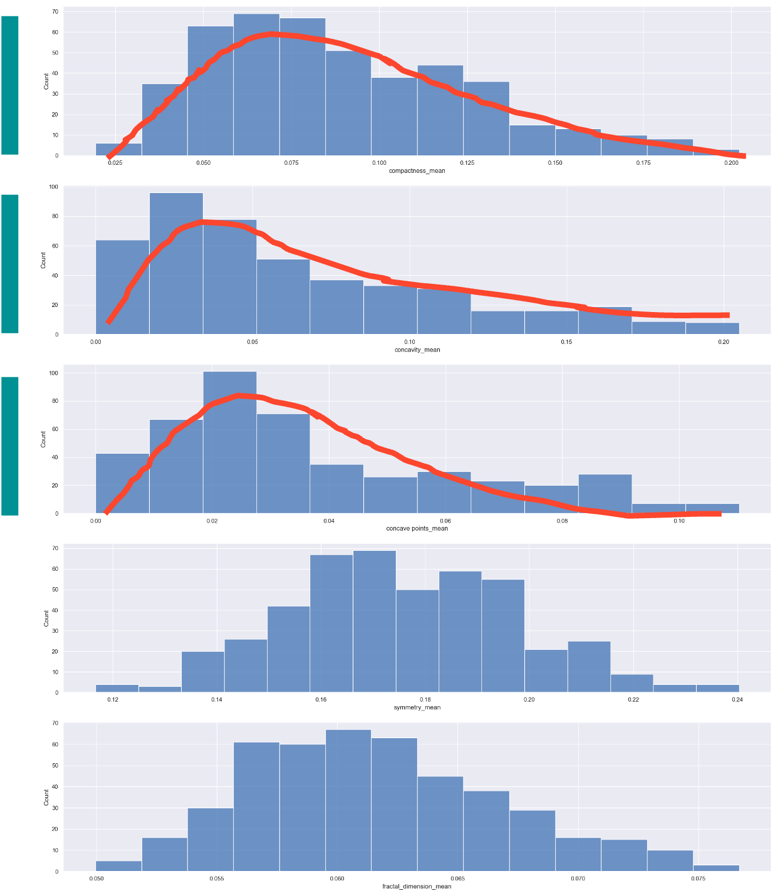
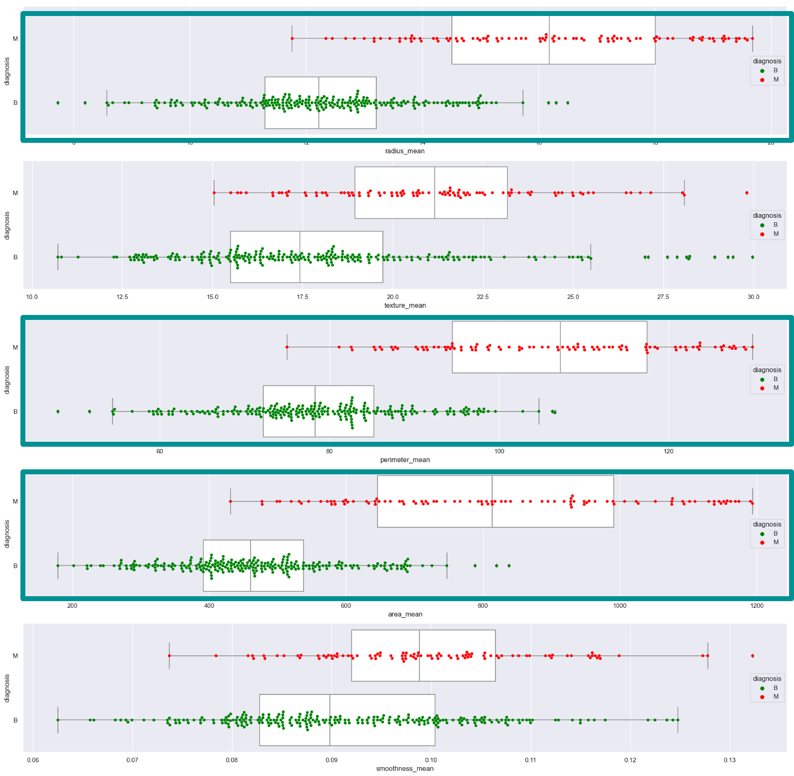
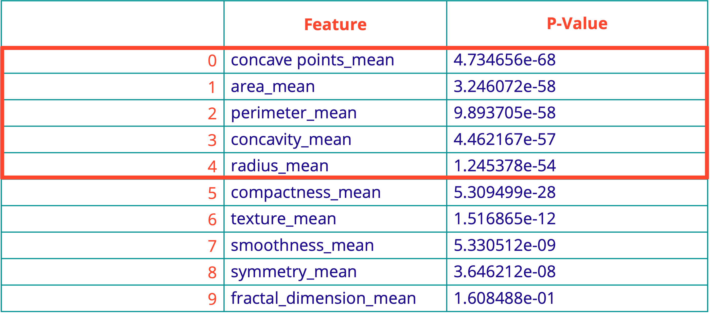
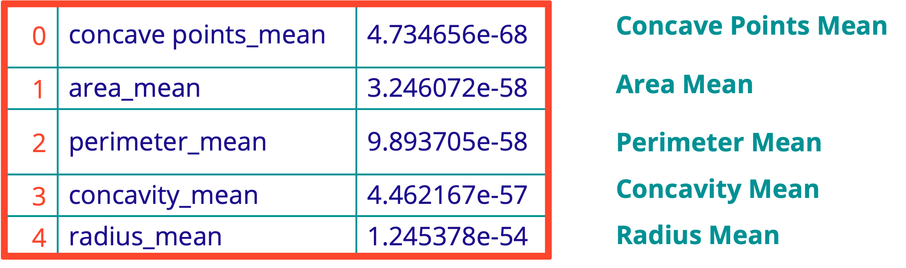
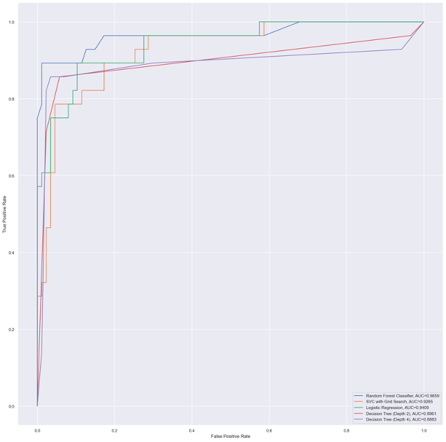
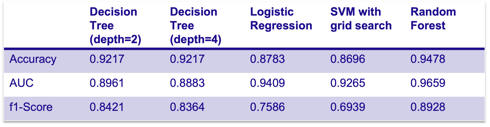
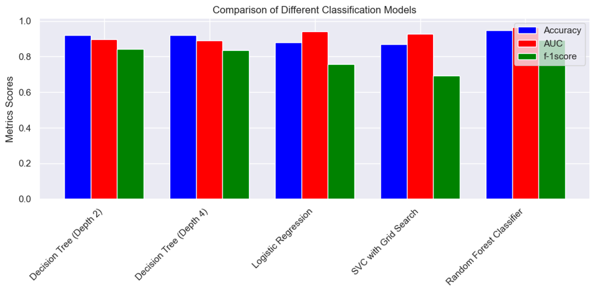

# SC1015 Data Science & Artificial Intelligence

## Submission Video Link: [Video](https://youtu.be/8OppWbQNVng)

## Breast Cancer Predictive Model

###### Preface

Breast cancer is the most prevalent cancer among women in Singapore.

Locally, more than 2000 women annually are diagnosed with breast cancer, and over 400 die from the disease. 1 in 13 women will get breast cancer in their lifetime [1].

**More needs to be done to tackle this problem with the resources and techniques we have.**

---

###### Gaps in current diagnostic methods

Current methods for diagnosing breast cancer have their limitations.
- 75% of surveyed doctors showed signs of disengagement and exhaustion [2]
- 40 million radiologist errors per annum [3]
- 12.5% of screening mammograms fail to detect breast cancer [15]

Is there a way for us to value-add to this field by augmenting the initial prediction phase?

---

###### Machine Learning as a potential solution?

There exists research suggesting that the prediction of breast cancer is a data-driven problem. Although this concept is still in its infancy, some are looking into its potential applications in the healthcare industry. That is the purpose of our project - to predict the diagnosis of breast cancer with machine learning models in order to arrive at the most suitable one. 

## The Data Science Pipeline :microscope:

Allow us to provide a brief overview of the steps we will take during each stage of the pipeline.

**NOTE**: The information displayed here is a **brief** overview of our project. Please refer to our notebook titled BreastCancerPrediction.ipynb for detailed information.

###### Practical Motivation
We note that the diagnosis of breast cancer can be a data-driven problem and can be predicted with a variety of patient-specific data. Ultimately, a medical professional should confirm the results, but machine learning can augment the initial prediction phase.

###### Sample Collection
**Our dataset (Breast Cancer Wisconsin (Diagnostic) Data Set) was obtained from Kaggle**
279239 downloads and 2190 total unique contributors
Features are computed from a digitized image of a fine needle aspirate (FNA) of a breast mass. They describe characteristics of the cell nuclei present in the image.

There dataset consists of 30 predictor columns. These columns are split into 3 categories of 10 identical columns each:  mean, standard, and worst. For this project, we chose the 10 columns under the *mean* category since this potentially best represents the *average* case.

###### Problem Formulation
`Problem Statement`: **How can we use machine learning models and a patient dataset to classify and predict breast cancer, to provide a reference for the early diagnosis of breast cancer?**

###### Data Preparation
`Goal`: To clean the dataset, remove outliers, and select the top 5 features/columns as the best 5 predictors for the response of Benign/Malignant breast cancer.

We will primarily focus on outliers as those points lying outside of the Q1 - 1.5(IQR) and Q3 + 1.5(IQR) whiskers of the box plots.

These outliers were removed and the box plots were re-plotted to confirm the results of the outlier removal.

###### Exploratory Analysis
Data Visualisation provided us with a clearer understanding of the dataset.

We primarily plotted the box plots, histograms, and swarm plots for the EDA process.

###### Statistical Description
After plotting the data as described above, some aspects had to be considered:
- Do the box plots show that the outliers have been successfully removed?
- Skewness can lead to inaccuracies in statistical models, especially regression-based ones in this project. Do the histograms depict a significant level of skew? Which features in particular exhibit a positive or negative skew? Are these features necessarily unsuitable for use in model prediction due to their skew?
- From the swarm plots, which of the 10 features have the lowest degrees of overlap between the Benign and Malignant box plots? These features are potentially best suited to be used in prediction.

###### Analytic Visualization

* Not all features shown here

To highlight interesting features, we carefully observed the data to identify features that match the criteria for 'good features' as described above. These aided us in selecting the top 5 features for model prediction.

###### Pattern Recognition
The interesting features highlighted above were not sufficient to convince us that they should be selected. We plunged into unchartered waters by performing an ANOVA Hypothesis Test to better justify if these 'good features' are truly the best ones.

[LEFT]: The results of our ANOVA Hypothesis Test, with the top 5 features for this test highlighted.
[RIGHT]: True enough, these top 5 features coincide with the top 5 features selected earlier. We shall proceed with these 5 features for model prediction.

###### Machine Learning
In this project, we chose to go with the **decision tree classifier, logistic regression, random forest and support vector machine with grid search**. These models were carefully selected from a wide variety of models based on several task-specific factors which we deemed as important.  

**The criteria are:**
- Dataset Types
    Our dataset comprised predominantly continuous variables, and our goal was to predict a categorical variable.
- Interpretability
    Because the model is meant to be used in a medical context, it is important for the model to be interpretable.
- Performance
    The model needed to perform well on metrics which were used for validation in the healthcare industry.

###### Algorithmic Optimization
**Logistic Regression**: We choose the hyperparameter C to be relatively small (0.1) compared to its default value of 1 since we are unsure if the dataset is truly representative of real world situation in breast cancer. This small C value places a larger weightage on the complexity penalty for extreme parameters in the model.

**Decision Trees**: To ascertain which model is better, we extended a depth 2 tree to a depth 4 tree to understand if classification accuracy would be improved. 

###### Information Presentation

###### Statistical Inference
We decided not to simply make a judgement based on the classification accuracy alone. In total, we settled on a total of 3 metrics for a more holistic assessment. They are:

**1. Classification Accuracy**
- Defined a the total true positives, plus the total true negatives, over the entire dataset size

**2. Area Under Curve for ROC Curve**
- We used a ROC curve to make a more informed judgement that better conforms to the standards set by clinicians in clinical trials. We are after all analyzing data in the healthcare sector
- An ROC curve (receiver operating characteristic curve) is a graph showing the performance of a classification model at all classification thresholds

**3. f1-score**
- Defined as the harmonic mean of precision and recall. It has some advantages over the classification accuracy metric as it is designed to work well on imbalanced data, which is characteristic of our chosen dataset

**False Negative Rate**
In the diagnosis of breast cancer, false negatives can be a big cause of concern. It may cause patients to avoid checkups thinking that they are fine when in fact the breast cancer is malignant and requires immediate treatment.

###### Intelligent Decision
From our results and analysis, we decided on the **Random Forest** as the most suitable model for breast cancer prediction. 

###### Ethical Consideration
Apart from the STEM aspect of AI, the social science & humanities perspective is paramount too. In the context of breast cancer prediction, some models used are a ‘black box’, which may have low trustworthiness among doctors and patients alike. However, should this reason alone deny AI from augmenting existing medical practices?

To circumvent this, we will have to allow medical professionals to follow the model's train of thought and determine if the results are consistent with their professional medical knowledge. This could potentially be achieved by selecting the decision tree since it gives insights at each node regarding the feature under consideration and the gini (probability of error). 

---

## Concluding Thoughts: Where do we go from here?

###### Recommendations
We see 2 main aspects that can potentially be improved upon in future iterations of this project. 

Dataset Selection
- The models can be trained on larger and more extensive datasets, to improve the robustness of the models.

Hyperparameter Tuning
- Hyperparameters of the various models can also be automatically tuned during training using informed search strategies to reduce training time.

###### Final Words
The models used in this project were never meant to replace the work of doctors or radiologists whom work tirelessly to diagnose breast cancer cases on a daily basis.

The purpose of our work is to test if machine learning can potentially be used to augment the diagnosis process considering how taxing it is on medical professionals, coupled with the fact that current methods are not perfect. 

Ultimately, a trained medical professional will have to determine if these results obtained are consistent with their knowledge. But we have already shown that the diagnosis of breast cancer can indeed be a data-driven problem.

## Credits and Delegation of Work

The following 2 individuals have worked through sleepless nights to materialize this project. 

`Wayne Tan Jing Heng`
- Responsible for performing machine learning using the Logistic Regression and Decision Tree models
- Spearheaded Exploratory Data Analysis and the Data Cleaning Process
- Documentation and refactoring 

`Chan Ming Han`
- Responsible for performing machine learning using the SVC With Grid and Random Forest models
- Took charge of the data-driven insights and analysis
- Video editing and submission

The other duties in the project were distributed equally amongst these 2 individuals.

## References

 [1]: Breast cancer. Singapore Cancer Society. (n.d.). Retrieved April 22, 2023, from https://www.singaporecancersociety.org.sg/learn-about-cancer/types-of-cancer/breast-cancer.html 

 [2] Auto, H. (2021, August 6). More doctors in Singapore face burnout, anxiety amid the pandemic. The Straits Times. https://www.straitstimes.com/life/more-doctors-in-singapore-face-burnout-anxiety-amid-the-pandemic#:~:text=It%20surveyed%203%2C075%20healthcare%20workers,signs%20of%20disengagement%20and%20exhaustion. 

 [3] Brady, A. P. (2017). Error and discrepancy in radiology: inevitable or avoidable? Insights Into Imaging, 8(1), 171–182. https://doi.org/10.1007/s13244-016-0534-1

 [4] Breast Cancer - Statistics. (2023, February 23). Cancer.Net. https://www.cancer.net/cancer-types/breast-cancer/statistics#:~:text=In%202020%2C%20an%20estimated%20684%2C996,United%20States%20after%20lung%20cancer.

 [5] Breast Cancer Statistics | How Common Is Breast Cancer? (n.d.). https://www.cancer.org/cancer/breast-cancer/about/how-common-is-breast-cancer.html#:~:text=Lifetime%20chance%20of%20getting%20breast,she%20will%20develop%20breast%20cancer.

 [6] Common Cancer Types. (2023, March 7). National Cancer Institute. https://www.cancer.gov/types/common-cancers#:~:text=The%20most%20common%20type%20of,are%20combined%20for%20the%20list.

 [7] Dahiru, T. (2011). P-Value, a true test of statistical significance? a cautionary note. Annals of Ibadan Postgraduate Medicine, 6(1). https://doi.org/10.4314/aipm.v6i1.64038

 [8] Dubey, A. (2023, April 4). Feature Selection Using Random forest - Towards Data Science. Medium. https://towardsdatascience.com/feature-selection-using-random-forest-26d7b747597f#:~:text=How%20does%20Random%20forest%20select,random%20extraction%20of%20the%20features. 

 [9] Hashmi, F. (2021, November 26). How to measure the correlation between a numeric and a categorical variable in Python - Thinking Neuron. Thinking Neuron. https://thinkingneuron.com/how-to-measure-the-correlation-between-a-numeric-and-a-categorical-variable-in-python

 [10] Kanstrén, T. (2022, March 30). A Look at Precision, Recall, and F1-Score - Towards Data Science. Medium. https://towardsdatascience.com/a-look-at-precision-recall-and-f1-score-36b5fd0dd3ec 

 [11] Limitations of Mammograms | How Accurate Are Mammograms? (n.d.). https://www.cancer.org/cancer/breast-cancer/screening-tests-and-early-detection/mammograms/limitations-of-mammograms.html#:~:text=Overall%2C%20screening%20mammograms%20miss%20about,when%20in%20fact%20they%20do. 

 [12] Nahm, F. S. (2022). Receiver operating characteristic curve: overview and practical use for clinicians. Korean Journal of Anesthesiology, 75(1), 25–36. https://doi.org/10.4097/kja.21209 

 [13] Narkhede, S. (2022, March 5). Understanding AUC - ROC Curve - Towards Data Science. Medium. https://towardsdatascience.com/understanding-auc-roc-curve-68b2303cc9c5
 

 [14] scipy.stats.f_oneway — SciPy v1.10.1 Manual. (n.d.). https://docs.scipy.org/doc/scipy/reference/generated/scipy.stats.f_oneway.html

 [15] Yadav, A. (2018, October 22). SUPPORT VECTOR MACHINES(SVM) - Towards Data Science. Medium. https://towardsdatascience.com/support-vector-machines-svm-c9ef22815589 

## Thank you!
